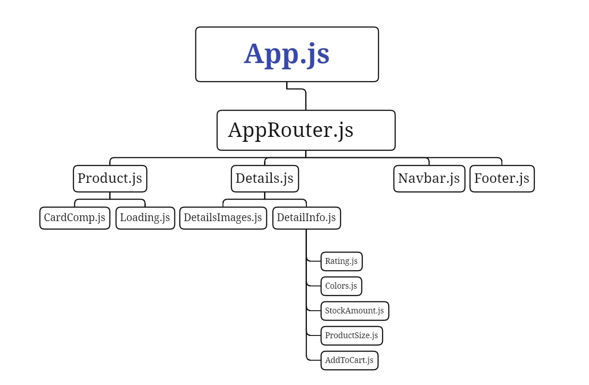

in this project ı did use to that Redux toolkit for state management  
project consists 4 pages and 10 component  
ı did use to react router dom for page router at project  
in addition in this project consists CSS , styled-components, MUI and AOS for effect and styling  

